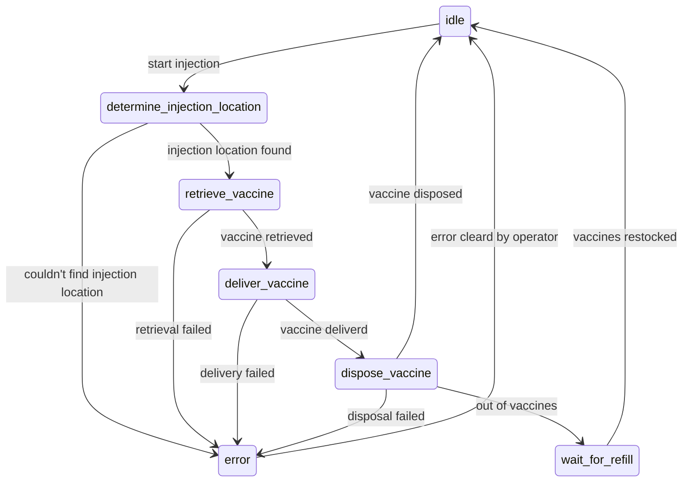

# Vaccine Robot State Management
This repo is for our Engineering Capstone Design Project which is a vaccine injecting robot. See more information here (put link when we have it). The main functionality of the robot is modeled here as a state machine in Python. The more low level controls are mostly handeled by Marlin, an open-source 3D printer firmware that we use to control our gantry. Image processing for locating injection sights and our frontend are handeled in separate repos.

# Modules
## Gantry Movement
Control for our gantry system is done with Marlin running on an Arduino 2560 MEGA. This module deals with the serial communication to the arduino to send GCode commands.

## Raspberry Pi GPIO
Control over the GPIO pins to get sensor readings and control actuators to place, remove and inject vaccines on the carriage.

## flask app
Sets up our REST API for interfacing with the front end and machine learning model.

## State Machine
Models the functionality of the robot as a finite state machine. Deals with high level control and makes calls to various other modules.

# State Machine

